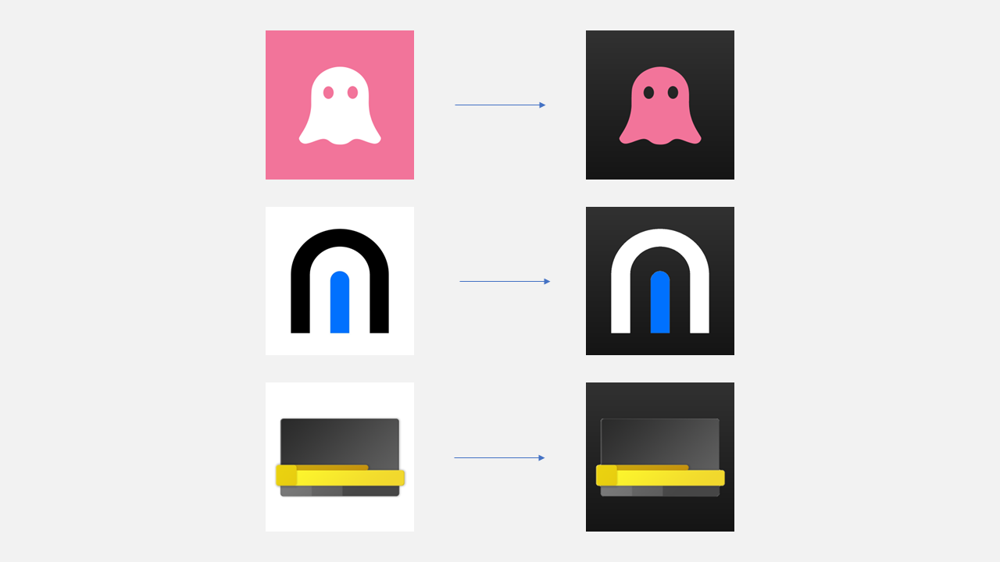

# Dark Icon Generator

Dark Icon Generator is a tool to convert light icons to dark icons using Node.js. Works quite like Apple's iOS 18 dark app icons. 



## Installation

You can install the package using npm or yarn:

```bash
npm install dark-icon-generator
```

```bash
yarn add dark-icon-generator
```

## Usage

To convert a light icon to a dark icon, you can use the `convertDarkIcon` function: 
    
```javascript
import { convertDarkIcon } from 'dark-icon-generator';
import * as fs from 'fs';

async function convertIcon() {
    const iconPath = 'path/to/light/icon.png';
    const icon = fs.readFileSync(iconPath);
    const darkIcon = await convertDarkIcon(icon);
    fs.writeFileSync('path/to/dark/icon.png', darkIcon);
}

convertIcon();
```
