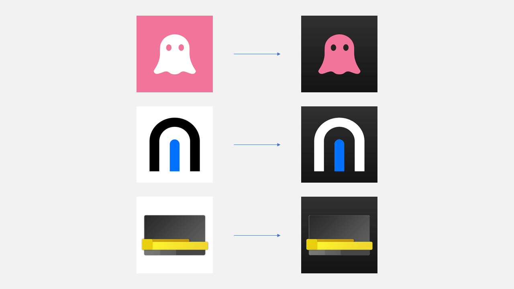

# Dark Icon Generator ✨🌓

[English](README.md) | **简体中文**

Dark Icon Generator 可以把亮色图标转换为更适合深色环境的图标，类似 iOS 18 的深色 App 图标。上传图像即可得到精美的深色图标。⚡️



演示站点：[https://dark-icon-generator.pages.dev/](https://dark-icon-generator.pages.dev/) 🚀

## 亮点
- 🖼️ 直接喂 Buffer、base64、URL 或浏览器文件即可。
- 🌑 自动识别浅色背景，叠加渐变，深色模式更自然。
- 💻 Node 版本依赖 `@napi-rs/canvas`，🧩 浏览器版本零原生依赖。
- 🧪 自带类型定义、ESM/CJS/浏览器多入口，并用 Jest 覆盖核心逻辑。

## 安装

```bash
npm install dark-icon-generator
# 或
pnpm add dark-icon-generator
yarn add dark-icon-generator
```

## 快速开始（Node）

```ts
import { convertDarkIcon } from 'dark-icon-generator';
import fs from 'node:fs';

async function main() {
  const lightIcon = fs.readFileSync('input.png');
  const darkIcon = await convertDarkIcon(lightIcon);
  fs.writeFileSync('output-dark.png', darkIcon);
}

main();
```

## 快速开始（浏览器）

```html
<input type="file" id="icon" accept="image/*" />


<script type="module">
  import { convertDarkIcon } from 'dark-icon-generator/browser';

  const input = document.querySelector('#icon');
  const preview = document.querySelector('#preview');

  input.addEventListener('change', async () => {
    const file = input.files?.[0];
    if (!file) return;

    const blob = await convertDarkIcon(file);
    preview.src = URL.createObjectURL(blob);
  });
  // 在线体验：https://dark-icon-generator.pages.dev/
</script>
```

## API
- Node：`convertDarkIcon(icon: string | Buffer | Uint8Array): Promise<Buffer>`，返回 PNG Buffer
- 浏览器：`convertDarkIcon(image: string | Blob | File | ImageBitmap | HTMLImageElement): Promise<Blob>`，返回 PNG Blob

## 小提示
- Node 端可传 base64 字符串或二进制缓冲区。
- 浏览器端可以传入 URL、用户上传的文件或 `ImageBitmap` 等，返回的 Blob 可用 `URL.createObjectURL` 直接展示。
- 本地示例：`npm install && npm run build && npx http-server examples/browser`，然后打开 http://localhost:8080 体验。
